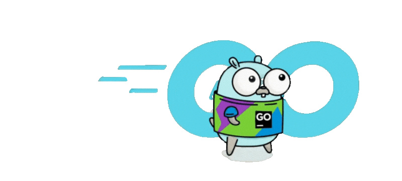

<!-- Profile Header -->

  

<!-- Introduction -->

  👋 Hi, I'm <strong>Zalven Dayao</strong> — Backend Engineer specializing in distributed systems, scalable architecture & high-performance APIs

<!-- Tech Stack -->

  
  
  
  
  
  
  
  
  
  
  

|  |  |
|---|---|

|  |  |
|---|---|

|  |
|---|

|  |
|---|

 

  

